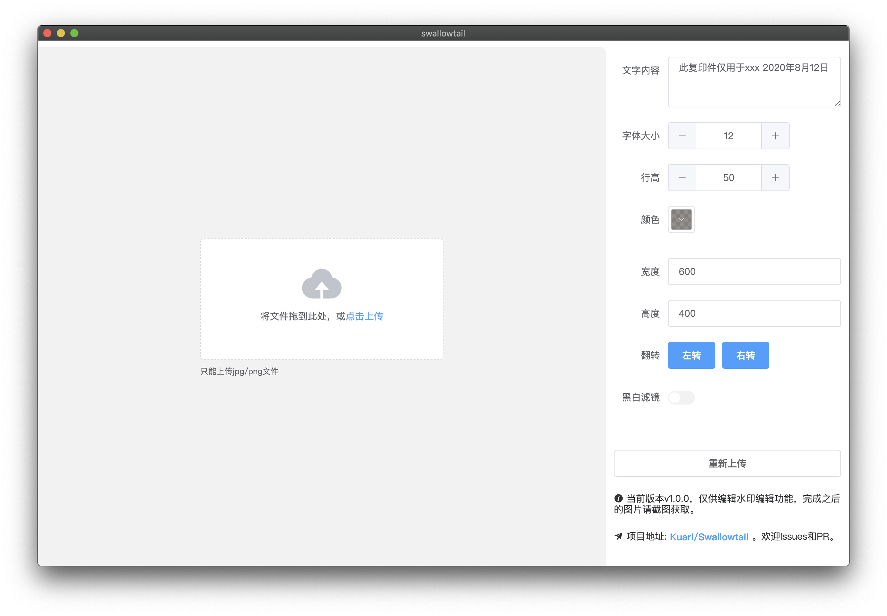
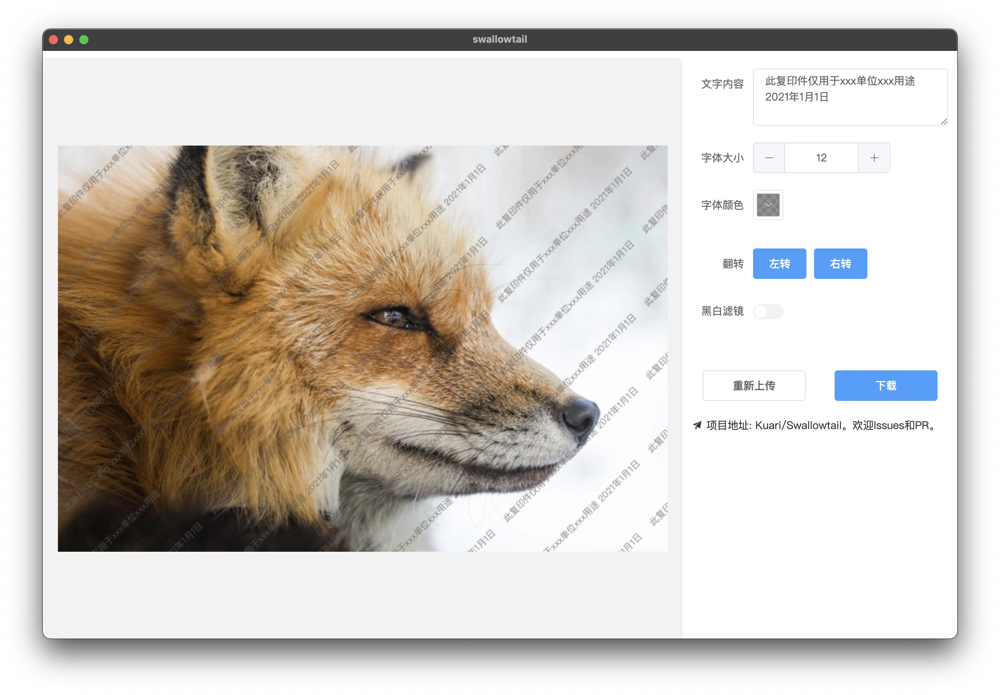

# SwallowTail

SwallowTail是一个自定义添加水印的客户端，支持Linux、Windows、Mac。当前为V1.0.0，仅支持编辑水印，需手动截图下载，客户端也在开发中。


[Demo](https://www.justmylife.cc/Swallowtail/)


## 截图






## 使用

```bash
git clone https://github.com/Kuari/Swallowtail.git
cd Swallowtail
yarn install
yarn serve // 运行
yarn build // 编译
```